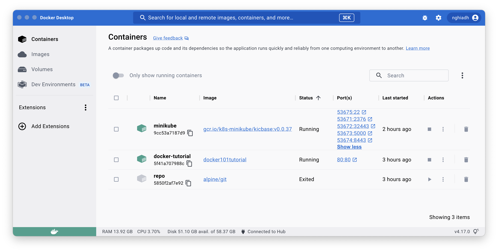
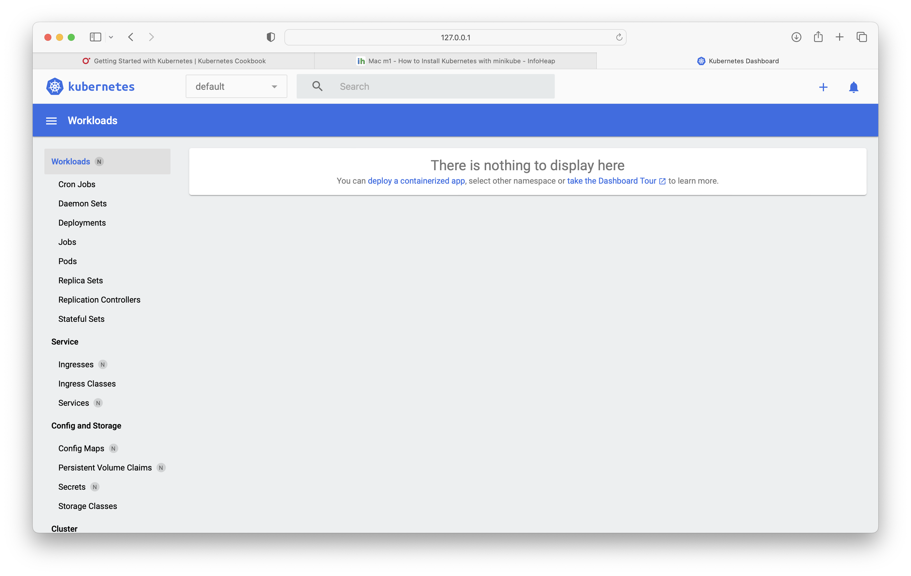

# Minikube with Docker on Apple Silicon

1. Download and install `Docker Desktop`:

Visit [Docker.com](https://www.docker.com) and download `Docker Desktop for Apple Chip`. Set it up. Use default settings.

2. Install `minikube` by `brew`:

```bash
brew install minikube
```

```bash
==> Fetching minikube
==> Downloading https://ghcr.io/v2/homebrew/core/minikube/manifests/1.29.0
######################################################################## 100.0%
==> Downloading https://ghcr.io/v2/homebrew/core/minikube/blobs/sha256:a290cff04bd396b39c8cc1ab48410f33aa5c3b474027133ddee2985e779ed8d0
==> Downloading from https://pkg-containers.githubusercontent.com/ghcr1/blobs/sha256:a290cff04bd396b39c8cc1ab48410f33aa5c3b474027133ddee2985e779ed8d0?se=2023-03-29T12%3A20%3A00Z&sig=SauqAdMKFGz1so80MbMQ7
######################################################################## 100.0%
==> Pouring minikube--1.29.0.arm64_ventura.bottle.tar.gz
==> Caveats
zsh completions have been installed to:
  /opt/homebrew/share/zsh/site-functions
==> Summary
🍺  /opt/homebrew/Cellar/minikube/1.29.0: 9 files, 75.2MB
==> Running `brew cleanup minikube`...
Disable this behaviour by setting HOMEBREW_NO_INSTALL_CLEANUP.
Hide these hints with HOMEBREW_NO_ENV_HINTS (see `man brew`).
```

3. Start `minikube`, it will use the installed `Docker` instance:

```bash
minikube start
```

```bash
😄  minikube v1.29.0 on Darwin 13.2.1 (arm64)
✨  Automatically selected the docker driver
📌  Using Docker Desktop driver with root privileges
👍  Starting control plane node minikube in cluster minikube
🚜  Pulling base image ...
💾  Downloading Kubernetes v1.26.1 preload ...
    > preloaded-images-k8s-v18-v1...:  330.51 MiB / 330.51 MiB  100.00% 54.26 M
    > gcr.io/k8s-minikube/kicbase...:  368.75 MiB / 368.75 MiB  100.00% 27.89 M
🔥  Creating docker container (CPUs=2, Memory=7802MB) ...
🐳  Preparing Kubernetes v1.26.1 on Docker 20.10.23 ...
    ▪ Generating certificates and keys ...
    ▪ Booting up control plane ...
    ▪ Configuring RBAC rules ...
🔗  Configuring bridge CNI (Container Networking Interface) ...
    ▪ Using image gcr.io/k8s-minikube/storage-provisioner:v5
🔎  Verifying Kubernetes components...
🌟  Enabled addons: storage-provisioner, default-storageclass
🏄  Done! kubectl is now configured to use "minikube" cluster and "default" namespace by default
```

4. `Docker` dashboard now shows `minikube` docker (!)



5. Install `kubectl`:

```bash
brew install kubectl
```

6. Verify `kubectl` installation:

```bash
kubectl version --client --output=yaml
```

```bash
clientVersion:
  buildDate: "2023-03-15T13:33:11Z"
  compiler: gc
  gitCommit: 9e644106593f3f4aa98f8a84b23db5fa378900bd
  gitTreeState: clean
  gitVersion: v1.26.3
  goVersion: go1.19.7
  major: "1"
  minor: "26"
  platform: darwin/arm64
kustomizeVersion: v4.5.7
```

7. Check `minikube` cluster info by `kubectl`:

```bash
kubectl cluster-info
```

```bash
Kubernetes control plane is running at https://127.0.0.1:53514
CoreDNS is running at https://127.0.0.1:53514/api/v1/namespaces/kube-system/services/kube-dns:dns/proxy

To further debug and diagnose cluster problems, use 'kubectl cluster-info dump'.
```

8. Review `kubectl` config

```bash
kubectl config view
```

```bash
apiVersion: v1
clusters:
- cluster:
    certificate-authority: /Users/nghia/.minikube/ca.crt
    extensions:
    - extension:
        last-update: Wed, 29 Mar 2023 08:49:31 EDT
        provider: minikube.sigs.k8s.io
        version: v1.29.0
      name: cluster_info
    server: https://127.0.0.1:53514
  name: minikube
contexts:
- context:
    cluster: minikube
    extensions:
    - extension:
        last-update: Wed, 29 Mar 2023 08:49:31 EDT
        provider: minikube.sigs.k8s.io
        version: v1.29.0
      name: context_info
    namespace: default
    user: minikube
  name: minikube
current-context: minikube
kind: Config
preferences: {}
users:
- name: minikube
  user:
    client-certificate: /Users/nghia/.minikube/profiles/minikube/client.crt
    client-key: /Users/nghia/.minikube/profiles/minikube/client.key
```

8. Review current context

```bash
kubectl config current-context
```

```bash
minikube
```

9. List all pods with in `kube-system` namespace:

```bash
kubectl get pods -n kube-system
```

```bash
NAME                               READY   STATUS    RESTARTS      AGE
coredns-787d4945fb-zhtxg           1/1     Running   0             90s
etcd-minikube                      1/1     Running   0             101s
kube-apiserver-minikube            1/1     Running   0             101s
kube-controller-manager-minikube   1/1     Running   0             101s
kube-proxy-2tbc8                   1/1     Running   0             90s
kube-scheduler-minikube            1/1     Running   0             101s
storage-provisioner                1/1     Running   1 (60s ago)   101s
```

10. List all namespaces:

```bash
kubectl get namespace
```

```bash
NAME              STATUS   AGE
default           Active   118s
kube-node-lease   Active   119s
kube-public       Active   119s
kube-system       Active   119s
```

11. Launch dashboard:

```bash
minikube dashboard
```

```bash
🔌  Enabling dashboard ...
    ▪ Using image docker.io/kubernetesui/metrics-scraper:v1.0.8
    ▪ Using image docker.io/kubernetesui/dashboard:v2.7.0
💡  Some dashboard features require the metrics-server addon. To enable all features please run:

	minikube addons enable metrics-server


🤔  Verifying dashboard health ...
🚀  Launching proxy ...
🤔  Verifying proxy health ...
🎉  Opening http://127.0.0.1:54974/api/v1/namespaces/kubernetes-dashboard/services/http:kubernetes-dashboard:/proxy/ in your default browser...
```

12. Enable `metrics-server`:

```bash
minikube addons enable metrics-server
```

```bash
💡  metrics-server is an addon maintained by Kubernetes. For any concerns contact minikube on GitHub.
You can view the list of minikube maintainers at: https://github.com/kubernetes/minikube/blob/master/OWNERS
    ▪ Using image registry.k8s.io/metrics-server/metrics-server:v0.6.2
🌟  The 'metrics-server' addon is enabled
```

13. Launch proxy:

```bash
kubectl proxy
```

```bash
Starting to serve on 127.0.0.1:8001
```

14. Open dashboard:



15. Stop `minikube`:

```bash
minikube stop
```

```bash
✋  Stopping node "minikube"  ...
🛑  Powering off "minikube" via SSH ...
🛑  1 node stopped.
```

16. (re)Start `minikube`:

```bash
minikube start
```

```bash
😄  minikube v1.29.0 on Darwin 13.2.1 (arm64)
✨  Using the docker driver based on existing profile
👍  Starting control plane node minikube in cluster minikube
🚜  Pulling base image ...
🔄  Restarting existing docker container for "minikube" ...
🐳  Preparing Kubernetes v1.26.1 on Docker 20.10.23 ...
🔗  Configuring bridge CNI (Container Networking Interface) ...
🔎  Verifying Kubernetes components...
    ▪ Using image gcr.io/k8s-minikube/storage-provisioner:v5
    ▪ Using image registry.k8s.io/metrics-server/metrics-server:v0.6.2
    ▪ Using image docker.io/kubernetesui/dashboard:v2.7.0
    ▪ Using image docker.io/kubernetesui/metrics-scraper:v1.0.8
💡  Some dashboard features require the metrics-server addon. To enable all features please run:

	minikube addons enable metrics-server


🌟  Enabled addons: storage-provisioner, default-storageclass, metrics-server, dashboard
🏄  Done! kubectl is now configured to use "minikube" cluster and "default" namespace by default
```

17. Delete `minikube`:

```bash
minikube stop; minikube delete
```

```bash
🔥  Deleting "minikube" in docker ...
🔥  Deleting container "minikube" ...
🔥  Removing /Users/nghia/.minikube/machines/minikube ...
💀  Removed all traces of the "minikube" cluster.
```
