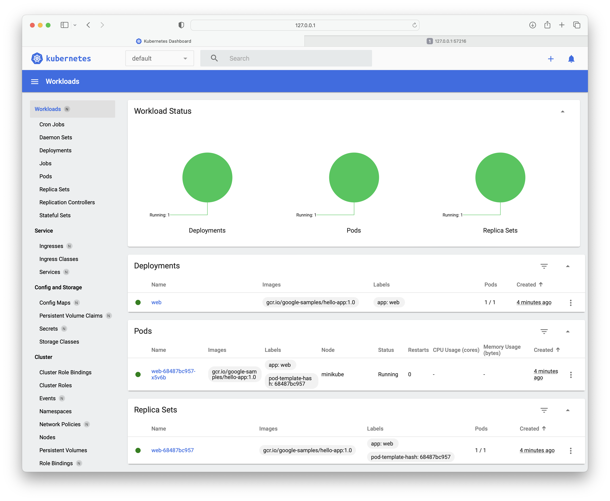
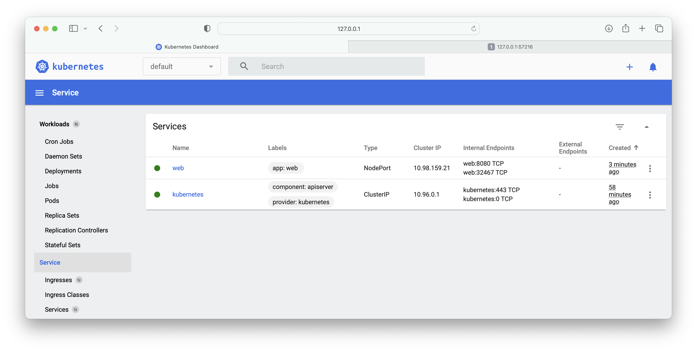
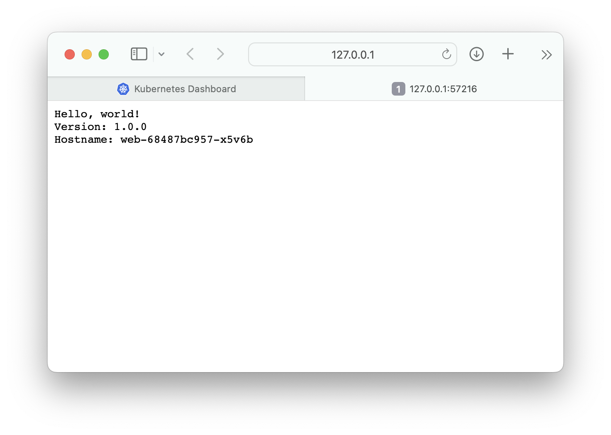

# Expose Google `hello web` application

Prerequisite: start `minikube` if it is not running.

1. Create a `Deployment` object:

```bash
% kubectl create deployment web --image=gcr.io/google-samples/hello-app:1.0
deployment.apps/web created
```

```bash
% kubectl get deploy web
NAME   READY   UP-TO-DATE   AVAILABLE   AGE
web    1/1     1            1           2m50s
```



2. Create a `Service` object that routes traffic to the containers in the `Deployment`:

```bash
% kubectl expose deployment web --type=NodePort --port=8080
service/web exposed
```

```bash
% kubectl get service web
NAME   TYPE       CLUSTER-IP     EXTERNAL-IP   PORT(S)          AGE
web    NodePort   10.98.159.21   <none>        8080:32467/TCP   50s
```

```bash
% kubectl get svc -o wide
NAME         TYPE        CLUSTER-IP     EXTERNAL-IP   PORT(S)          AGE     SELECTOR
kubernetes   ClusterIP   10.96.0.1      <none>        443/TCP          41m     <none>
web          NodePort    10.107.71.89   <none>        8080:32201/TCP   2m35s   app=web
```



3. Connect to `web`:

```bash
% minikube service web
|-----------|------|-------------|---------------------------|
| NAMESPACE | NAME | TARGET PORT |            URL            |
|-----------|------|-------------|---------------------------|
| default   | web  |        8080 | http://192.168.49.2:32467 |
|-----------|------|-------------|---------------------------|
🏃  Starting tunnel for service web.
|-----------|------|-------------|------------------------|
| NAMESPACE | NAME | TARGET PORT |          URL           |
|-----------|------|-------------|------------------------|
| default   | web  |             | http://127.0.0.1:57216 |
|-----------|------|-------------|------------------------|
🎉  Opening service default/web in default browser...
❗  Because you are using a Docker driver on darwin, the terminal needs to be open to run it.
```


