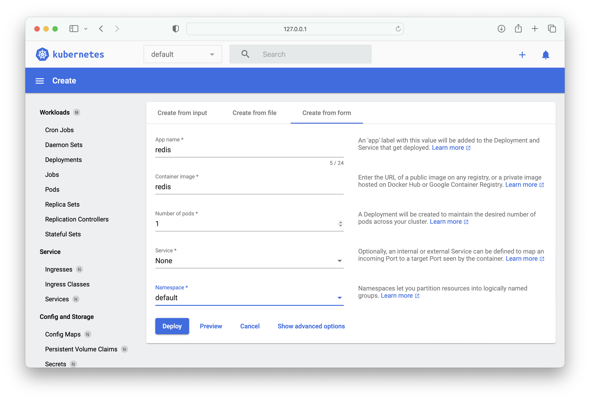

# Create `Redis` app by using `minikube dashboard`

Prerequisite: start `minikube` if it is not running.

1. Start `minikube dashboard`:

```bash
minikube dashboard --port 8000
```

```bash
🤔  Verifying dashboard health ...
🚀  Launching proxy ...
🤔  Verifying proxy health ...
🎉  Opening http://127.0.0.1:8000/api/v1/namespaces/kubernetes-dashboard/services/http:kubernetes-dashboard:/proxy/ in your default browser...
```

2. Create `Redis` app from form:



3. `Redis` on `minikube dashboard`:


4. `Redis` info:

```bash
kubectl get pods,rs,deployments
```

```bash
NAME                         READY   STATUS    RESTARTS   AGE
pod/redis-57c8d5cfdd-j7wd8   1/1     Running   0          18m

NAME                               DESIRED   CURRENT   READY   AGE
replicaset.apps/redis-57c8d5cfdd   1         1         1       18m

NAME                    READY   UP-TO-DATE   AVAILABLE   AGE
deployment.apps/redis   1/1     1            1           18m
```

5. `Redis` logs:

```bash
kubectl logs redis-57c8d5cfdd-j7wd8 -f
```

```bash
1:C 29 Mar 2023 20:49:06.048 # oO0OoO0OoO0Oo Redis is starting oO0OoO0OoO0Oo
1:C 29 Mar 2023 20:49:06.048 # Redis version=7.0.10, bits=64, commit=00000000, modified=0, pid=1, just started
1:C 29 Mar 2023 20:49:06.048 # Warning: no config file specified, using the default config. In order to specify a config file use redis-server /path/to/redis.conf
1:M 29 Mar 2023 20:49:06.048 * monotonic clock: POSIX clock_gettime
1:M 29 Mar 2023 20:49:06.049 * Running mode=standalone, port=6379.
1:M 29 Mar 2023 20:49:06.049 # Server initialized
1:M 29 Mar 2023 20:49:06.051 * Ready to accept connections
```