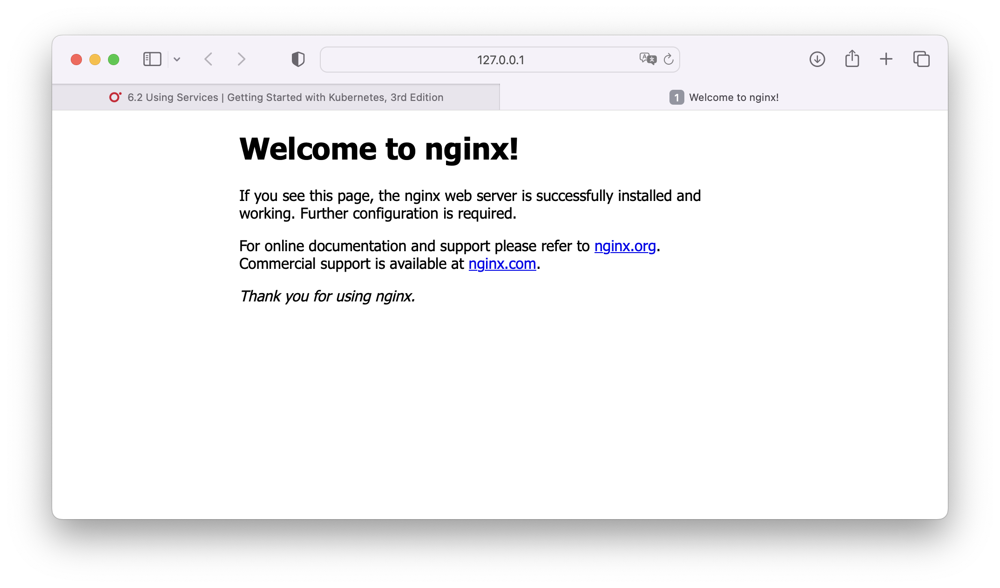

# Scaling `nginx` on Apple Silicon

1. Install `minikube`, then `minikube start`

```bash
% kubectl config get-contexts
CURRENT   NAME             CLUSTER          AUTHINFO         NAMESPACE
          docker-desktop   docker-desktop   docker-desktop
*         minikube         minikube         minikube         default
```

```bash
% kubectl get nodes
NAME       STATUS   ROLES           AGE   VERSION
minikube   Ready    control-plane   74s   v1.26.1
```

```bash
% kubectl get ns
NAME              STATUS   AGE
default           Active   86s
kube-node-lease   Active   87s
kube-public       Active   87s
kube-system       Active   87s
```

2. *Option 1*: Access via `minikube tunnel`:

Create `nginx` deployment with 3 replicas:

```bash
% kubectl create deployment nginxsvc --image=nginx --replicas=3
deployment.apps/nginxsvc created
```

```bash
% kubectl get all -o wide --selector app=nginxsvc
NAME                            READY   STATUS    RESTARTS   AGE     IP         NODE             NOMINATED NODE   READINESS GATES
pod/nginxsvc-5647fc5c85-5ht5g   1/1     Running   0          3m15s   10.1.0.8   docker-desktop   <none>           <none>
pod/nginxsvc-5647fc5c85-f2nr4   1/1     Running   0          3m15s   10.1.0.6   docker-desktop   <none>           <none>
pod/nginxsvc-5647fc5c85-xvb4w   1/1     Running   0          3m15s   10.1.0.7   docker-desktop   <none>           <none>

NAME                       READY   UP-TO-DATE   AVAILABLE   AGE     CONTAINERS   IMAGES   SELECTOR
deployment.apps/nginxsvc   3/3     3            3           3m15s   nginx        nginx    app=nginxsvc

NAME                                  DESIRED   CURRENT   READY   AGE     CONTAINERS   IMAGES   SELECTOR
replicaset.apps/nginxsvc-5647fc5c85   3         3         3       3m15s   nginx        nginx    app=nginxsvc,pod-template-hash=5647fc5c85
```

Exposing to port `80`:

```bash
% kubectl expose deploy nginxsvc --type=NodePort --port=80
service/nginxsvc exposed
```

Review the current state:

```bash
% kubectl get all
NAME                            READY   STATUS    RESTARTS   AGE
pod/nginxsvc-68f865964f-jwgk5   1/1     Running   0          73s
pod/nginxsvc-68f865964f-kb9kc   1/1     Running   0          73s
pod/nginxsvc-68f865964f-rjfkl   1/1     Running   0          73s

NAME                 TYPE        CLUSTER-IP      EXTERNAL-IP   PORT(S)        AGE
service/kubernetes   ClusterIP   10.96.0.1       <none>        443/TCP        88s
service/nginxsvc     NodePort    10.98.215.158   <none>        80:30098/TCP   69s

NAME                       READY   UP-TO-DATE   AVAILABLE   AGE
deployment.apps/nginxsvc   3/3     3            3           77s

NAME                                  DESIRED   CURRENT   READY   AGE
replicaset.apps/nginxsvc-68f865964f   3         3         3       74s
```

```bash
% minikube service nginxsvc
|-----------|----------|-------------|---------------------------|
| NAMESPACE |   NAME   | TARGET PORT |            URL            |
|-----------|----------|-------------|---------------------------|
| default   | nginxsvc |          80 | http://192.168.49.2:30098 |
|-----------|----------|-------------|---------------------------|
🏃  Starting tunnel for service nginxsvc.
|-----------|----------|-------------|------------------------|
| NAMESPACE |   NAME   | TARGET PORT |          URL           |
|-----------|----------|-------------|------------------------|
| default   | nginxsvc |             | http://127.0.0.1:50472 |
|-----------|----------|-------------|------------------------|
🎉  Opening service default/nginxsvc in default browser...
❗  Because you are using a Docker driver on darwin, the terminal needs to be open to run it.
```



3. *Option 2a*:  Access by port forwarding:

Create `nginx` deployment with 3 replicas:

```bash
% kubectl create deployment nginxsvc --image=nginx --replicas=3
```

Exposing to port `80`:

```bash
% kubectl expose deploy nginxsvc --type=NodePort --port=80
```

Forward to port `8888` on the localhost (`127.0.0.1`):

```bash
% kubectl port-forward svc/nginxsvc 8888:80
Forwarding from 127.0.0.1:8888 -> 80
Forwarding from [::1]:8888 -> 80
```

From other terminal

```bash
% curl 127.0.0.1:8888
<!DOCTYPE html>
<html>
<head>
<title>Welcome to nginx!</title>
<style>
html { color-scheme: light dark; }
body { width: 35em; margin: 0 auto;
font-family: Tahoma, Verdana, Arial, sans-serif; }
</style>
</head>
<body>
<h1>Welcome to nginx!</h1>
<p>If you see this page, the nginx web server is successfully installed and
working. Further configuration is required.</p>

<p>For online documentation and support please refer to
<a href="http://nginx.org/">nginx.org</a>.<br/>
Commercial support is available at
<a href="http://nginx.com/">nginx.com</a>.</p>

<p><em>Thank you for using nginx.</em></p>
</body>
</html>
```

4. *Option 2b*: Access by port forwarding with address:

Create `nginx` deployment with 3 replicas:

```bash
% kubectl create deployment nginxsvc --image=nginx --replicas=3
```

Exposing to port `80`:

```bash
% kubectl expose deploy nginxsvc --type=NodePort --port=80
```

Forward to port `8888` on an selected interface (`en1`):

```bash
% kubectl port-forward svc/nginxsvc --address=$(ipconfig getifaddr en1) 8888:80
Forwarding from 192.168.2.29:8888 -> 80
```

From other terminal

```bash
% curl $(ipconfig getifaddr en1):8888
<!DOCTYPE html>
<html>
<head>
<title>Welcome to nginx!</title>
<style>
html { color-scheme: light dark; }
body { width: 35em; margin: 0 auto;
font-family: Tahoma, Verdana, Arial, sans-serif; }
</style>
</head>
<body>
<h1>Welcome to nginx!</h1>
<p>If you see this page, the nginx web server is successfully installed and
working. Further configuration is required.</p>

<p>For online documentation and support please refer to
<a href="http://nginx.org/">nginx.org</a>.<br/>
Commercial support is available at
<a href="http://nginx.com/">nginx.com</a>.</p>

<p><em>Thank you for using nginx.</em></p>
</body>
</html>
```

5. *Option 3*: Access by `LoadBalancer`:

Create `nginx` deployment with 3 replicas:

```bash
% kubectl create deployment nginxsvc --image=nginx --replicas=3
```

Exposing to port `80`:

```bash
% kubectl expose deploy nginxsvc --type=LoadBalancer --port=80
```

Create a tunnel:

```bash
% minikube tunnel
✅  Tunnel successfully started

📌  NOTE: Please do not close this terminal as this process must stay alive for the tunnel to be accessible ...

❗  The service/ingress nginxsvc requires privileged ports to be exposed: [80]
🔑  sudo permission will be asked for it.
🏃  Starting tunnel for service nginxsvc.
Password:

```

On the other terminal:

```bash
% kubectl get services
NAME         TYPE           CLUSTER-IP       EXTERNAL-IP   PORT(S)        AGE
kubernetes   ClusterIP      10.96.0.1        <none>        443/TCP        66s
nginxsvc     LoadBalancer   10.106.208.119   127.0.0.1     80:30441/TCP   32s
```

Now access via the `EXTERNAL-IP`

```bash
% curl 127.0.0.1
<!DOCTYPE html>
<html>
<head>
<title>Welcome to nginx!</title>
<style>
html { color-scheme: light dark; }
body { width: 35em; margin: 0 auto;
font-family: Tahoma, Verdana, Arial, sans-serif; }
</style>
</head>
<body>
<h1>Welcome to nginx!</h1>
<p>If you see this page, the nginx web server is successfully installed and
working. Further configuration is required.</p>

<p>For online documentation and support please refer to
<a href="http://nginx.org/">nginx.org</a>.<br/>
Commercial support is available at
<a href="http://nginx.com/">nginx.com</a>.</p>

<p><em>Thank you for using nginx.</em></p>
</body>
</html>
```